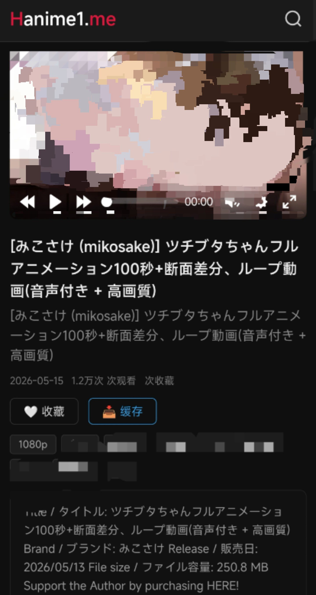

# HannimeCacheServer

基于 Spring Boot 的后端代理缓存服务，作为前端与上游 Hanime API 之间的中间层，提供 API 代理转发、视频文件缓存与下载任务管理。

## 系统架构

```
┌──────────┐     HTTP      ┌─────────────────────┐     HTTP      ┌──────────────┐
│  前端     │ ────────────→ │  HannimeCacheServer  │ ────────────→ │  上游 Hanime  │
│  SPA     │ ←──────────── │  (代理 + 缓存)        │ ←──────────── │  API         │
└──────────┘               └──────────┬──────────┘               └──────────────┘
                                      │
                                      ▼
                             ┌──────────────────┐
                             │  SQLite + 本地    │
                             │  视频文件存储      │
                             └──────────────────┘
```

**核心职责：**

1. **API 代理转发** — 接收前端请求，从上游获取数据，对视频 URL 做本地缓存替换后返回
2. **页面数据缓存** — 使用 Caffeine 内存缓存首页/观看页/用户页数据，减少上游请求，支持定时预热
3. **视频文件缓存** — 将上游视频下载到本地，提供支持 Range 断点续传的本地文件访问
4. **下载任务管理** — 管理视频下载任务的生命周期（创建、调度、状态追踪）

## 技术栈

| 组件 | 版本           | 说明 |
|------|--------------|------|
| JDK | 21           | 运行环境 |
| Spring Boot | 4.0.6        | Web MVC 框架 |
| MyBatis-Plus | 3.5.15       | ORM + 分页插件 |
| SQLite | 3.45.1.0     | 嵌入式数据库 |
| HanimeClient | 2.6-SNAPSHOT | 上游 API Java SDK |
| Nginx | 1.30         | 反向代理 + 视频静态文件服务 |
| Caffeine | 3.1.2        | 本地内存缓存 |
| Docker | —            | 容器化部署 |

## 项目结构

```
src/main/java/com/shikou/hannime/
├── api/                          # REST 控制器
│   ├── ProxyAPI.java             #   代理转发（首页/搜索/观看/用户/播放列表）
│   ├── CacheAPI.java             #   本地视频文件服务（Range 断点续传）
│   ├── ConfigAPI.java            #   运行时配置管理
│   └── VideoDownloadTaskAPI.java #   下载任务 CRUD
├── service/                      # 业务逻辑
│   ├── ProxyService.java         #   代理 + 视频 URL 缓存替换
│   ├── VideoService.java         #   视频元数据管理
│   ├── VideoDownloadTaskService.java  # 下载任务管理
│   └── TaskConfigService.java    #   运行时配置
├── dao/                          # MyBatis-Plus Mapper
│   ├── VideoMapper.java
│   └── VideoDownloadTaskMapper.java
├── entities/                     # 数据实体
│   ├── domain/                   #   Video, VideoDownloadTask
│   ├── request/                  #   CreateTaskRequest, UpdateConfigRequest 等
│   ├── response/                 #   Result, VideoResponse
│   └── enums/                    #   TaskStatus
├── config/                       # 配置类
│   ├── CacheConfig.java          #   Caffeine 缓存配置
│   ├── HannimeClientConfig.java
│   ├── MybatisPlusConfig.java
│   ├── SQLiteConfig.java
│   └── VideoStoreConfig.java
├── manager/
│   └── CacheManager.java         # 缓存管理器（首页/观看页/用户页）
├── task/
│   ├── CacheTaskScheduler.java   # 定时缓存预热
│   └── VideoTaskScheduler.java   # 定时扫描 + 下载调度
├── util/
│   ├── AssertUtils.java
│   └── HanimeVideoUtils.java     #   画质匹配工具
├── exception/                    # 异常处理
│   ├── BizException.java
│   ├── ErrorCode.java
│   └── GlobalExceptionAdviser.java
└── HannimeApplication.java       # 启动入口
```

## API 接口

### 代理接口 `/api/proxy/*`

| 接口 | 方法 | 说明 |
|------|------|------|
| `/api/proxy/home` | GET | 首页（轮播 + 分区视频列表，*缓存命中*） |
| `/api/proxy/search` | GET | 搜索页（首次，含筛选条件） |
| `/api/proxy/search/videos` | GET | 搜索结果（翻页） |
| `/api/proxy/watch?v={code}` | GET | 观看页（视频详情 + 评论 + 相关影片，*缓存命中*） |
| `/api/proxy/user/{userId}` | GET | 用户页（首页 Tab，*缓存命中*） |
| `/api/proxy/user/{userId}/videos` | GET | 用户页（视频 Tab，分页） |
| `/api/proxy/user/{userId}/playlists` | GET | 用户页（播放清单 Tab，分页） |
| `/api/proxy/playlist` | GET | 播放列表页（分页） |
| `/api/proxy/comment` | GET | 评论列表 |
| `/api/proxy/comment/replies` | GET | 评论回复 |

### 缓存接口 `/cache/*`

| 接口 | 方法 | 说明 |
|------|------|------|
| `/cache/video-info/{videoCode}` | GET | 查询视频元数据及本地缓存地址 |
| `/cache/getVideo` | GET | 获取本地视频文件（支持 Range 断点续传） |

### 配置接口 `/config/*`

| 接口 | 方法 | 说明 |
|------|------|------|
| `/config/get` | GET | 获取当前配置 |
| `/config/update` | POST | 动态更新配置（画质、存储路径） |

### 下载任务接口 `/video-download-task/*`

| 接口 | 方法 | 说明 |
|------|------|------|
| `/video-download-task/list` | GET | 分页查询下载任务 |
| `/video-download-task/create` | POST | 创建下载任务 |
| `/video-download-task/retry` | POST | 重试失败任务 |
| `/video-download-task/cancel` | POST | 取消下载任务 |

## 快速开始

### 环境要求

- JDK 21+
- Maven 3.9+
- （可选）Docker & Docker Compose

### 安装 HanimeClient 依赖

本项目依赖 [HanimeClient](https://github.com/1209198147/HannimeAPIClient)，该组件未发布到公共 Maven 仓库，需手动安装到本地仓库。

**从源码构建安装**

```bash
# 1. 克隆 HanimeClient 仓库
git clone https://github.com/1209198147/HannimeAPIClient.git
cd HannimeAPIClient

# 2. 安装到本地 Maven 仓库
mvn clean install -DskipTests
```


### 本地开发

```bash
# 1. 克隆项目
git clone <repo-url>
cd HannimeCacheServer

# 2. 安装 HanimeClient 依赖（见上方「安装 HanimeClient 依赖」）

# 3. 修改配置
# 编辑 src/main/resources/application.properties
# 设置 video.store.path 为你的视频存储目录

# 4. 编译启动
mvn clean package -DskipTests
java -jar target/Hannime-0.0.1-SNAPSHOT.jar

# 5. 访问
# 应用: http://localhost:8080
```

### Docker 部署（推荐）

Docker 构建时需要将 `HanimeClient-2.6-SNAPSHOT.jar` 复制到项目根目录，请先按上方「从源码构建安装」步骤克隆 HanimeClient 仓库，并将其 package 到项目目录：

```bash
# 1. 克隆 HanimeClient 并构建 jar
git clone https://github.com/1209198147/HannimeAPIClient.git
cd HannimeAPIClient
mvn clean package -DskipTests

# 2. 将构建产物复制到 HannimeCacheServer 项目根目录
cp target/HanimeClient-2.6-SNAPSHOT.jar <你的HannimeCacheServer路径>/
```

确认项目根目录下存在 `HanimeClient-2.6-SNAPSHOT.jar` 后，启动服务：

```bash
# 3. 启动所有服务（应用 + Nginx）
docker-compose up -d --build

# 4. 查看日志
docker-compose logs -f hannime-app

# 5. 停止
docker-compose down
```

服务启动后通过 Nginx（端口 80）访问：

```
http://localhost
```

Docker 缓存相关环境变量：

| 环境变量 | 默认值 | 说明 |
|---------|-------|------|
| `CACHE_ENABLE` | `true` | 是否启用页面缓存 |
| `CACHE_DURATION` | `1` | 缓存有效期 |
| `CACHE_UNIT` | `MINUTES` | 缓存时间单位 |
| `CACHE_MAX_SIZE` | `1000` | 缓存最大条目数 |
| `CACHE_TASK_ENABLE` | `true` | 是否启用定时缓存预热 |

Docker 数据持久化映射：

| 宿主机目录 | 容器目录 | 用途 |
|-----------|---------|------|
| `./video-store/` | `/video-store/` | 视频文件存储（app 写入，nginx 只读） |
| `./data/` | `/app/data/` | SQLite 数据库 |
| `./logs/` | `/app/logs/` | 应用日志 |

## 配置说明

### 核心配置 (`application.properties`)

```properties
# 视频存储路径（Docker 中由 VIDEO_STORE_PATH 环境变量覆盖）
video.store.path=/video-store/

# 默认下载画质
video.quality=lowest

# Hanime API 区域与语言
hannime.zone=HK
hannime.lang=zhs

# 页面数据缓存（Caffeine）
cache.enabled=true            # 是否启用缓存
cache.duration=1              # 缓存有效期
cache.unit=MINUTES            # 缓存时间单位（SECONDS/MINUTES/HOURS）
cache.maxSize=1000            # 缓存最大条目数
cache.task.enable=true        # 是否启用定时缓存预热任务

# SQLite 数据库（Docker 中由 SPRING_DATASOURCE_URL 覆盖）
spring.datasource.url=jdbc:sqlite:hannime.db
```

### Nginx 配置

Nginx 在 Docker 架构中承担两层职责：

1. **反向代理** — 将 `/api/` 等请求转发到 Spring Boot 后端
2. **静态文件服务** — `/resources/` 路径直接 serve 视频文件，绕过应用层，实现高性能大文件传输（Range 支持、sendfile 零拷贝）

配置文件：`conf/nginx_docker.conf`（Docker） / `conf/nginx_linux.conf`（Linux） / `conf/nginx_win.conf`（Windows）

## 数据库

项目使用 SQLite 嵌入式数据库，启动时自动建表（`schema.sql`）。

### video 表

| 字段 | 类型 | 说明 |
|------|------|------|
| id | INTEGER PK | 主键 |
| video_code | VARCHAR(16) | 视频代码 |
| quality | VARCHAR(16) | 画质 |
| path | VARCHAR(1024) | 本地文件路径（NULL=未下载） |

### video_download_task 表

| 字段 | 类型 | 说明 |
|------|------|------|
| id | INTEGER PK | 主键 |
| video_code | VARCHAR(16) | 视频代码 |
| status | INTEGER | 状态（0-待下载, 1-下载中, 2-已完成, 3-失败, 4-已取消） |
| quality | VARCHAR(16) | 目标画质 |
| create_time | DATETIME | 创建时间 |
| update_time | DATETIME | 更新时间 |

## 下载任务状态机

```
PENDING ──→ PROCESSING ──→ COMPLETED
   │                          
   └──→ FAILED ──→ (recover) ──→ PROCESSING
   
CANCELLED（API 拒绝，不再重试）
```

## 预览

>  
> 
>  
> 
